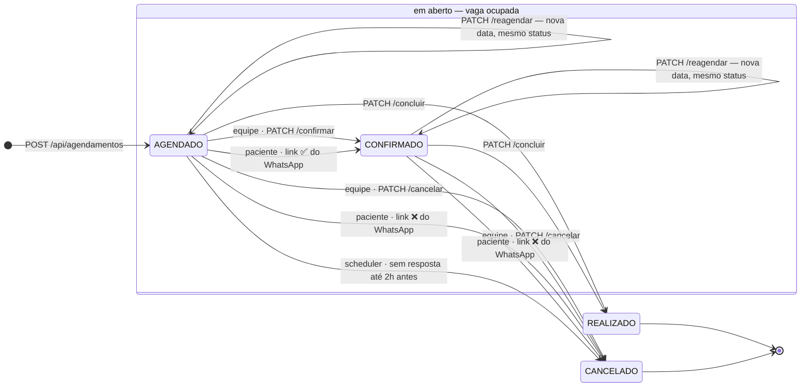
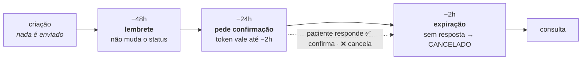

# 🗓 Ciclo de vida do agendamento

> Levantado do código em `backend/src/main/java/com/prontudigital/backend` (módulos
> `agendamento` e `notificacao`), branch `config-whatsapp`.
>
> Última revisão: **01/09/2026**.
>
> Documentos vizinhos: **`WHATSAPP.md`** (o porquê da integração e as contas da Meta),
> **`TESTE_WHATSAPP_DEV.md`** (como testar em dev) e
> **`NOTIFICACOES_WHATSAPP_STATUS.md`** (o que mudou na branch e o que falta).

O enum `StatusAgendamento` tem seis valores, mas só quatro são alcançáveis. Enquanto o
agendamento está **em aberto** (`AGENDADO` ou `CONFIRMADO`) ele ocupa a vaga do
profissional. Sair desse grupo é definitivo: `CANCELADO` e `REALIZADO` são rejeitados
pelas guardas de `cancelar`, `concluir` e `reagendar`.

---

## 1. A máquina de estados

Três origens distintas levam a `CANCELADO`, e elas **não são equivalentes** — ver a
[seção 4](#4-o-que-o-diagrama-esconde).

---

## 2. Transições, uma a uma

| De | Para | Gatilho | Guarda | Onde |
|---|---|---|---|---|
| — | `AGENDADO` | `POST /api/agendamentos` | período válido, profissional e paciente livres, regra avaliação → tratamento | `AgendamentoServiceImpl:282` |
| `AGENDADO` | `CONFIRMADO` | `PATCH /{id}/confirmar` — equipe | status precisa ser exatamente `AGENDADO` | `AgendamentoServiceImpl:330` |
| `AGENDADO` | `CONFIRMADO` | `GET /api/confirmacao/{token}/confirmar` — paciente | token não usado e dentro da validade; **não olha o status atual** | `NotificacaoWhatsappServiceImpl:198` |
| `AGENDADO` `CONFIRMADO` | `CANCELADO` | `PATCH /{id}/cancelar` — equipe | não pode estar cancelado nem realizado; **≥ 24h** de antecedência, exceto `ADMIN` | `AgendamentoServiceImpl:350` |
| `AGENDADO` `CONFIRMADO` | `CANCELADO` | `GET /api/confirmacao/{token}/recusar` — paciente | token não usado e dentro da validade | `NotificacaoWhatsappServiceImpl:242` |
| `AGENDADO` | `CANCELADO` | scheduler de expiração, a cada 15 min | consulta nas próximas 2h e confirmação `ENVIADO` sem resposta | `NotificacaoWhatsappServiceImpl:283` |
| `AGENDADO` `CONFIRMADO` | `REALIZADO` | `PATCH /{id}/concluir` — equipe | não pode estar cancelado nem já realizado; grava `concluidoEm` | `AgendamentoServiceImpl:435` |
| `AGENDADO` `CONFIRMADO` | *mesmo estado* | `PATCH /{id}/reagendar` — equipe | não pode estar cancelado nem realizado; novo horário precisa estar livre | `AgendamentoServiceImpl:385` |

O limite de 24h para cancelar está em `ANTECEDENCIA_MIN_CANCELAMENTO_HORAS`
(`AgendamentoServiceImpl:67`).

---

## 3. Quando o WhatsApp entra

Os três jobs de `AgendamentoNotificacaoScheduler` rodam **a cada 15 minutos** e se
posicionam pelo **horário da consulta**, nunca pela data de criação. Só o último muda o
status.

| Job | Cron | Janela varrida | Efeito no status |
|---|---|---|---|
| `processarLembretes48h` | `0 */15 * * * *` | início entre `agora+46h` e `agora+50h` | nenhum — mensagem informativa |
| `processarConfirmacoes24h` | `0 */15 * * * *` | início entre `agora+22h` e `agora+26h` | nenhum; gera o token e envia os dois links |
| `processarExpiracoes` | `0 */15 * * * *` | início entre `agora` e `agora+2h` | `AGENDADO` → `CANCELADO` se a confirmação foi enviada e não respondida |

Reenvio duplicado é barrado pelo `log_notificacoes_whatsapp`: cada par
(agendamento, tipo) só é gravado uma vez. Para reenviar em teste, apague a linha.

> Durante os testes desta branch a confirmação chegou a sair **1 minuto após a criação**
> do agendamento. Essa mudança foi revertida — vale a regra das 24h descrita acima.

---

## 4. O que o diagrama esconde

**Cancelar pela equipe ≠ cancelar pelo WhatsApp.**
`cancelar` publica `AgendamentoCanceladoEvento`, e `FilaEsperaServiceImpl:103` chama o
primeiro da fila daquele profissional (`ATIVO` → `NOTIFICADO`). Recusa e expiração passam
por `liberarAgendamento:323`, que **não publica evento nenhum**: grava `CANCELADO` e
insere o próprio paciente na fila com prioridade `-100`. Nesses dois caminhos a vaga
abre sem ninguém ser avisado.

**Dois estados existem só no papel.**
`REMARCADO` e `NAO_COMPARECEU` estão no enum e são **lidos** — pelos schedulers e pelos
relatórios (`RelatorioServiceImpl:119-120`) — mas nenhum ponto do código os grava.
Reagendar preserva o status atual em vez de mover para `REMARCADO`, e não existe endpoint
que registre falta.

**O link é mais permissivo que a tela.**
`confirmar` pela equipe exige status `AGENDADO`. Já `confirmarViaToken` valida só o token
e sobrescreve o status seja qual for — inclusive o de um agendamento cancelado no meio
tempo.

**A validade do link se ajusta.**
O token vence 2h antes da consulta. Se esse instante já tiver passado quando a mensagem
sai, a validade vira o próprio horário da consulta e o texto informa a data-limite real,
em vez do fixo *"até 2h antes"*.
