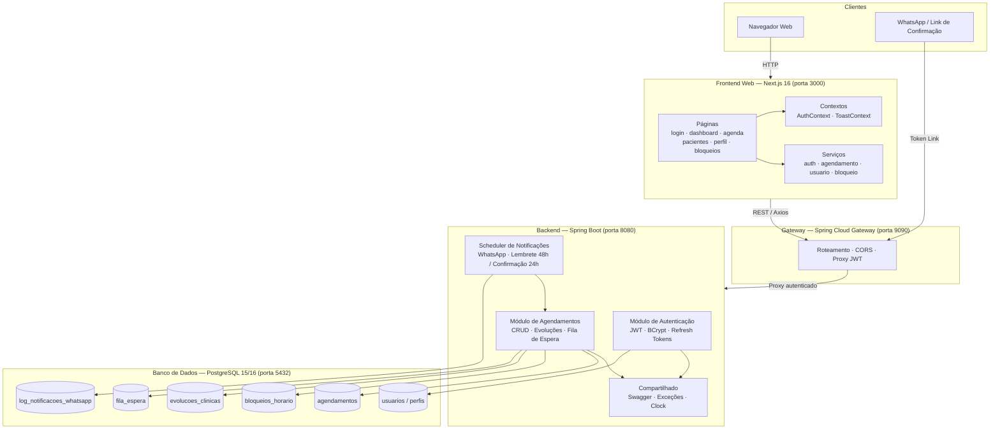
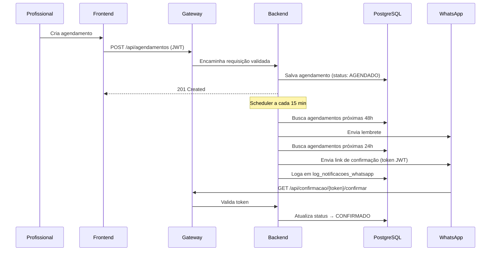
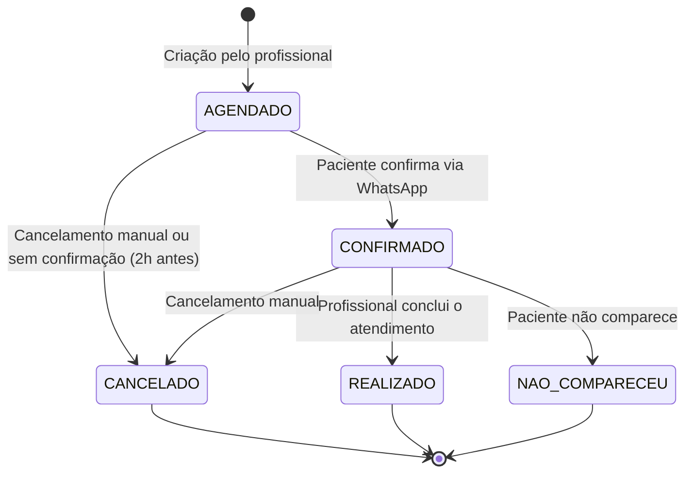
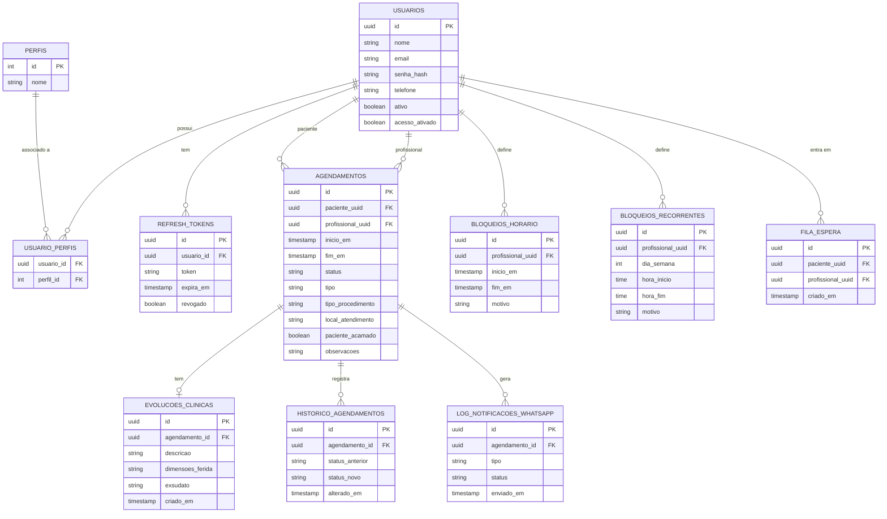

# 🩺 ProntuDigital


Sistema de prontuário eletrônico e agendamento para clínicas de enfermagem especializadas em **podologia** e **tratamento de feridas**. Permite o cadastro de pacientes, agendamento de consultas, registro de evoluções clínicas e envio automatizado de notificações via WhatsApp.

---

## 📋 Índice

- [Arquitetura](#-arquitetura)
- [Tecnologias](#-tecnologias)
- [Estrutura do Projeto](#-estrutura-do-projeto)
- [Banco de Dados](#-banco-de-dados)
- [API REST](#-api-rest)
- [Autenticação & Segurança](#-autenticação--segurança)
- [Variáveis de Ambiente](#-variáveis-de-ambiente)
- [Executando o Projeto](#-executando-o-projeto)
- [Testes](#-testes)

---

## 🏗 Arquitetura

O ProntuDigital adota uma arquitetura em três camadas: **gateway centralizado**, **backend monolítico modular** e **frontend React**. Todo o tráfego dos clientes passa pelo gateway, que valida o JWT e encaminha ao backend.



### Fluxo de Agendamento e Notificações WhatsApp



### Ciclo de Vida do Agendamento



---

## 🛠 Tecnologias

### Backend — `backend/`

| Tecnologia | Versão | Função |
|---|---|---|
| Java | 21 (LTS) | Linguagem principal |
| Spring Boot | 3.5.3 | Framework de aplicação |
| Spring Security | Incluído no Boot | Autenticação e autorização |
| Spring Data JPA | Incluído no Boot | ORM e repositórios |
| JJWT | 0.11.5 | Geração e validação de tokens JWT (HS512) |
| Flyway | Incluído no Boot | Migrações versionadas de banco de dados |
| PostgreSQL Driver | Incluído no Boot | Conexão com banco |
| SpringDoc OpenAPI | — | Documentação Swagger UI |
| Maven | 3.x (wrapper incluso) | Build e gerenciamento de dependências |

### Gateway — `gateway/`

| Tecnologia | Versão | Função |
|---|---|---|
| Java | 21 (LTS) | Linguagem principal |
| Spring Cloud Gateway | 2025.0.0 | Roteamento, CORS e proxy reverso |
| Spring WebFlux | Incluído | I/O reativo (non-blocking) |
| Maven | 3.x (wrapper incluso) | Build |

### Frontend Web — `frontend-web/`

| Tecnologia | Versão | Função |
|---|---|---|
| Next.js | 16.0.1 | Framework React com App Router |
| React | 19.2.0 | Biblioteca de UI |
| TypeScript | 5.x | Tipagem estática |
| Tailwind CSS | 4.x | Estilização utilitária |
| Axios | 1.13.2 | Cliente HTTP com interceptors (refresh token) |
| Lucide React | — | Ícones |
| Font Awesome | — | Ícones |
| ESLint + Prettier | — | Lint e formatação de código |
| npm | — | Gerenciador de pacotes |

### Infraestrutura

| Tecnologia | Função |
|---|---|
| PostgreSQL 15/16 | Banco de dados relacional |
| Docker + Docker Compose | Containerização e orquestração |
| Nginx | Servidor estático para build de produção do frontend |

---

## 📁 Estrutura do Projeto

```
prontudigital/
│
├── backend/                                 # API Java Spring Boot
│   ├── src/main/java/com/prontudigital/backend/
│   │   ├── autenticacao/                    # Módulo de autenticação
│   │   │   ├── config/                      # SecurityConfig
│   │   │   ├── controladores/               # AutenticacaoController, UsuarioController
│   │   │   ├── dto/                         # LoginRequestDTO, JwtResponseDTO, etc.
│   │   │   ├── entidades/                   # Usuario, Perfil, RefreshToken
│   │   │   ├── filtros/                     # JWTFilter (interceptor de requisições)
│   │   │   ├── repositorios/
│   │   │   ├── seguranca/                   # JwtTokenProvider, UserDetailsServiceImpl
│   │   │   └── servicos/
│   │   ├── agendamento/                     # Módulo de agendamentos
│   │   │   ├── agendador/                   # Cron jobs (execução a cada 15 min)
│   │   │   ├── controladores/               # AgendamentoController, BloqueioController
│   │   │   ├── dto/
│   │   │   ├── entidades/                   # Agendamento, BloqueioHorario, FilaEspera
│   │   │   ├── enums/                       # StatusAgendamento, TipoAgendamento, etc.
│   │   │   ├── eventos/                     # Spring Events
│   │   │   ├── repositorios/
│   │   │   └── servicos/
│   │   └── compartilhado/                   # Exceções globais, Swagger, Clock
│   ├── src/main/resources/
│   │   ├── application.yaml                 # Configuração base (porta 8080)
│   │   ├── application-dev.yaml
│   │   ├── application-prod.yaml
│   │   └── db/migracoes/                    # Flyway V1–V17
│   ├── src/test/                            # Testes unitários e de integração
│   ├── Dockerfile.dev
│   ├── Dockerfile.prod
│   └── pom.xml
│
├── gateway/                                 # Spring Cloud Gateway (porta 9090)
│   ├── src/main/java/com/prontudigital/gateway/
│   ├── src/main/resources/
│   │   ├── application.yml
│   │   ├── application-dev.yml
│   │   └── application-docker.yml
│   ├── Dockerfile
│   └── pom.xml
│
├── frontend-web/                            # Next.js 16 + React 19
│   ├── app/                                 # App Router do Next.js
│   │   ├── layout.tsx                       # Root layout (AuthProvider, Toast)
│   │   ├── page.tsx                         # Redirect por perfil de acesso
│   │   ├── login/
│   │   ├── dashboard/                       # Painel administrativo
│   │   ├── agenda/                          # Agenda do profissional
│   │   ├── agendar/                         # Criar novo agendamento
│   │   ├── minha-agenda/                    # Agenda do paciente
│   │   ├── pacientes/                       # Gestão de pacientes
│   │   ├── perfil/                          # Perfil e senha do usuário
│   │   └── bloqueios/                       # Gerenciar bloqueios de horário
│   ├── components/                          # Componentes React reutilizáveis
│   ├── contexts/                            # AuthContext, ToastContext
│   ├── hooks/                               # Custom hooks
│   ├── lib/                                 # Serviços de chamadas à API
│   │   ├── auth.service.ts
│   │   ├── agendamento.service.ts
│   │   ├── usuario.service.ts
│   │   └── bloqueio.service.ts
│   ├── tipos/                               # Definições de tipos TypeScript
│   ├── Dockerfile.dev
│   ├── Dockerfile.prod
│   ├── nginx.conf
│   └── package.json
│
├── docker/
│   └── dev/
│       ├── docker-compose.yml               # Stack de desenvolvimento com hot-reload
│       └── .env.dev.example
│
├── docker-compose.yml                       # Stack de produção
├── .env.example
└── README.md
```

---

## 🗄 Banco de Dados

O esquema é gerenciado pelo **Flyway** com 17 migrações versionadas localizadas em `backend/src/main/resources/db/migracoes/`.

| Migration | Tabela / Alteração | Descrição |
|---|---|---|
| V1 | `usuarios` | Usuários com UUID, status ativo |
| V2 | `perfis` | Perfis (ADMIN, PROFISSIONAL, PACIENTE) |
| V3 | `usuario_perfis` | Relação N:N usuário–perfil |
| V4 | `refresh_tokens` | Tokens de sessão com controle de revogação |
| V5 | `agendamentos` | Agendamentos com status e tipo |
| V6 | `bloqueios_horario` | Bloqueios avulsos de horário |
| V7 | `fila_espera` | Fila para reagendamento automático |
| V8 | — | Dados de exemplo |
| V9 | `historico_agendamentos` | Audit log de mudanças de status |
| V10 | — | Agendamentos de exemplo |
| V11 | `log_notificacoes_whatsapp` | Log de notificações enviadas |
| V12 | `acesso_ativado` | Flag de ativação de credenciais de paciente |
| V13 | `tipo_procedimento` | Tipo do procedimento (PODIATRIA, TRATAMENTO_FERIDAS) |
| V14 | `local_atendimento / paciente_acamado` | Local e status de mobilidade |
| V15 | — | Campos de evolução clínica (dimensões, exsudato, etc.) |
| V16 | `evolucoes_clinicas` | Separação da evolução clínica em tabela própria |
| V17 | `bloqueios_recorrentes` | Regras de bloqueio por dia da semana |



---

## 🔌 API REST

A API é exposta pelo backend na porta `8080` e acessada pelos clientes através do gateway na porta `9090`. Documentação interativa disponível em `http://localhost:8080/swagger-ui.html`.

### Autenticação — `/api/auth`

| Método | Endpoint | Descrição | Acesso |
|---|---|---|---|
| `POST` | `/registrar` | Cadastra profissional | Público |
| `POST` | `/login` | Autentica e retorna JWT + refresh token | Público |
| `POST` | `/renovar-token` | Renova o access token | Público |
| `POST` | `/logout` | Revoga sessão | Autenticado |
| `POST` | `/cadastrar-paciente` | Cadastra paciente (nome + telefone) | ADMIN / PROFISSIONAL |
| `POST` | `/ativar-acesso` | Ativa credenciais de paciente existente | ADMIN / PROFISSIONAL |

### Usuários — `/api/usuarios`

| Método | Endpoint | Descrição | Acesso |
|---|---|---|---|
| `GET` | `/me` | Dados do usuário autenticado | Autenticado |
| `GET` | `/` | Lista todos os usuários | ADMIN |
| `GET` | `/{id}` | Busca usuário por ID | ADMIN |
| `GET` | `/uuid/{uuid}` | Busca usuário por UUID | ADMIN / PROFISSIONAL |
| `PUT` | `/{id}` | Atualiza usuário completo | ADMIN |
| `PATCH` | `/{id}/perfil` | Atualiza nome, e-mail, telefone | Autenticado |
| `PATCH` | `/{id}/senha` | Altera senha | Autenticado |
| `DELETE` | `/{id}` | Remove usuário | ADMIN |

### Agendamentos — `/api/agendamentos`

| Método | Endpoint | Descrição | Acesso |
|---|---|---|---|
| `POST` | `/` | Cria agendamento | ADMIN / PROFISSIONAL |
| `GET` | `/{id}` | Detalha agendamento | Autenticado |
| `GET` | `/agenda?data=DATE&tipo=DIA\|SEMANA\|MES` | Agenda por período | PROFISSIONAL |
| `GET` | `/meus` | Agendamentos do paciente logado | PACIENTE |
| `GET` | `/avaliacoes/{id}/tratamentos` | Tratamentos vinculados a uma avaliação | Autenticado |
| `GET` | `/pacientes` | Pacientes com agendamentos nos últimos 3 meses (paginado) | ADMIN / PROFISSIONAL |
| `PATCH` | `/{id}/confirmar` | Confirma presença | PACIENTE / PROFISSIONAL |
| `PATCH` | `/{id}/cancelar` | Cancela agendamento | Autenticado |
| `PATCH` | `/{id}/reagendar` | Reagenda para nova data/hora | PROFISSIONAL |
| `PATCH` | `/{id}/concluir` | Marca como realizado | PROFISSIONAL |
| `PATCH` | `/{id}/evolucao-enfermagem` | Registra a Ficha de Evolução de Enfermagem (só `AVALIACAO`) | PROFISSIONAL |
| `PATCH` | `/{id}/evolucao-curativo` | Registra a Ficha de Evolução Diária – Curativos (só `TRATAMENTO`) | PROFISSIONAL |

### Procedimentos — `/api/procedimentos`

| Método | Endpoint | Descrição | Acesso |
|---|---|---|---|
| `GET` | `/` | Lista procedimentos ativos (`?incluirInativos=true` inclui os desativados) | Público |
| `GET` | `/{id}` | Detalha procedimento | Público |
| `POST` | `/` | Cria procedimento | ADMIN |
| `PUT` | `/{id}` | Atualiza procedimento (inclui ativar/desativar) | ADMIN |
| `DELETE` | `/{id}` | Remove procedimento sem vínculos | ADMIN |

### Prontuário — `/api/prontuario/pacientes/{pacienteUuid}`

Todos os endpoints aplicam a **RN03** via `ProntuarioPermissaoPolicy`:

- **Leitura** (`podeVisualizar`): ADMIN sempre; PROFISSIONAL só de pacientes que já
  atendeu; PACIENTE só o próprio prontuário.
- **Escrita** (`podeEditar`): ADMIN e PROFISSIONAL vinculado — o paciente nunca edita
  dados clínicos.

| Método | Endpoint | Descrição | Acesso |
|---|---|---|---|
| `GET` | `/historico` | Histórico clínico consolidado (timeline) | RN03 leitura |
| `GET` | `/anamnese` | Anamnese do paciente (1:1) | RN03 leitura |
| `POST` | `/anamnese` | Registra anamnese | RN03 escrita |
| `PUT` | `/anamnese` | Atualiza anamnese | RN03 escrita |
| `GET` | `/prescricoes` | Lista prescrições | RN03 leitura |
| `POST` | `/prescricoes` | Cria prescrição | RN03 escrita |
| `PUT` | `/prescricoes/{uuid}` | Atualiza prescrição | RN03 escrita |
| `DELETE` | `/prescricoes/{uuid}` | Remove prescrição | RN03 escrita |
| `GET` | `/anexos` | Lista anexos | RN03 leitura |
| `POST` | `/anexos` | Upload `multipart/form-data` (JPG/PNG/WEBP/PDF, 10 MB) | RN03 escrita |
| `GET` | `/anexos/{uuid}/conteudo` | Stream do arquivo (inline) | RN03 leitura |
| `DELETE` | `/anexos/{uuid}` | Remove anexo | RN03 escrita |

### Horários de Trabalho — `/api/horarios-trabalho`

Expediente semanal do profissional (RF05). Alimenta a validação de disponibilidade:
um agendamento precisa caber inteiro em uma janela do dia da semana. Profissional
**sem nenhuma janela cadastrada não é restringido** — a regra só passa a valer
depois que o expediente é definido.

| Método | Endpoint | Descrição | Acesso |
|---|---|---|---|
| `POST` | `/` | Cria janela de atendimento | ADMIN / PROFISSIONAL (própria agenda) |
| `GET` | `/?profissionalUuid=` | Lista janelas do profissional | Autenticado |
| `GET` | `/public?profissionalUuid=` | Idem, para a tela pública de agendamento | Público |
| `DELETE` | `/{id}` | Remove janela | ADMIN / PROFISSIONAL (própria agenda) |

### Bloqueios de Horário — `/api/bloqueios-horario`

| Método | Endpoint | Descrição | Acesso |
|---|---|---|---|
| `POST` | `/` | Cria bloqueio avulso | PROFISSIONAL |
| `GET` | `/` | Lista bloqueios por profissional/período | PROFISSIONAL |
| `DELETE` | `/{id}` | Remove bloqueio | PROFISSIONAL |
| `GET` | `/public` | Lista pública (sem autenticação) | Público |
| `POST` | `/recorrentes` | Cria regra recorrente por dia da semana | PROFISSIONAL |
| `GET` | `/recorrentes` | Lista regras recorrentes | PROFISSIONAL |
| `DELETE` | `/recorrentes/{id}` | Remove regra recorrente | PROFISSIONAL |

### Confirmação WhatsApp — `/api/confirmacao` (Público)

| Método | Endpoint | Descrição |
|---|---|---|
| `GET` | `/{token}/confirmar` | Confirma agendamento via link enviado pelo WhatsApp |
| `GET` | `/{token}/recusar` | Recusa e insere o paciente na fila de espera |

---

## 🔐 Autenticação & Segurança

- **Algoritmo JWT**: HS512 (HMAC com SHA-512)
- **Tokens**: access token + refresh token com rotação por revogação no logout
- **Armazenamento de refresh tokens**: persistidos no banco com controle de expiração
- **Codificação de senhas**: BCrypt
- **Sessão**: stateless — sem HttpSession
- **Controle de acesso**: `@PreAuthorize` por perfil em cada endpoint
- **CORS**: configurado no gateway para `http://localhost:3000`

### Perfis de Usuário

| Perfil | Capacidades |
|---|---|
| `ADMIN` | Gestão completa de usuários, acesso a todos os dados |
| `PROFISSIONAL` | Agenda, agendamentos, bloqueios, evoluções clínicas |
| `PACIENTE` | Visualiza próprios agendamentos, confirma presença |

---

## ⚙️ Variáveis de Ambiente

### Raiz do Projeto — `.env.example`

```env
# PostgreSQL
PG_HOST=localhost
PG_PORT=5432
PG_DB=prontudigital
PG_USER=user_admin
PG_PASSWORD=secret123
```

### Backend — `application.yaml`

```env
# Banco de dados
SPRING_DATASOURCE_URL=jdbc:postgresql://<host>:5432/prontudigital
SPRING_DATASOURCE_USERNAME=user
SPRING_DATASOURCE_PASSWORD=senha

# JWT (alterar em produção!)
APP_JWT_SECRET=<chave-aleatoria-minimo-64-caracteres>
APP_JWT_ACCESS_EXPIRATION_MS=900000         # 15 min recomendado em prod
APP_JWT_REFRESH_EXPIRATION_MS=604800000     # 7 dias

# Flyway
SPRING_FLYWAY_URL=jdbc:postgresql://<host>:5432/prontudigital
SPRING_FLYWAY_USER=user
SPRING_FLYWAY_PASSWORD=senha
```

### Gateway — `application.yml`

```env
BACKEND_URL=http://backend:8080
```

### Frontend — `next.config.ts`

```env
NEXT_PUBLIC_API_URL=http://localhost:9090
```

> **Atenção em produção**: substitua `APP_JWT_SECRET` por uma chave aleatória forte e reduza `APP_JWT_ACCESS_EXPIRATION_MS` para no máximo 15 minutos.

---

## 🚀 Executando o Projeto

### Pré-requisitos

- Docker 24+ e Docker Compose v2
- _(Sem Docker)_ Java 21, Maven 3.9+, Node.js 20+, PostgreSQL 15+

### Desenvolvimento com Docker (recomendado)

```bash
# 1. Clone o repositório
git clone <url-do-repositorio>
cd prontudigital

# 2. Configure as variáveis de ambiente
cp docker/dev/.env.dev.example docker/dev/.env.dev

# 3. Suba o stack completo com hot-reload
cd docker/dev
docker compose up
```

| Serviço | URL |
|---|---|
| Frontend Web | http://localhost:3000 |
| Gateway | http://localhost:9090 |
| Backend (Swagger) | http://localhost:8080/swagger-ui.html |
| PostgreSQL | localhost:5432 |

### Produção com Docker

```bash
# Configure as credenciais de produção
cp .env.example .env

docker compose up -d
```

> O `docker-compose.yml` de produção inicia backend, gateway e banco de dados. O frontend é servido via build estático no Nginx a partir do `Dockerfile.prod`.

### Sem Docker (local)

```bash
# 1. Inicie o PostgreSQL na porta 5432

# 2. Backend (nova aba)
cd backend
./mvnw spring-boot:run -Dspring-boot.run.profiles=local

# 3. Gateway (nova aba)
cd gateway
./mvnw spring-boot:run -Dspring-boot.run.profiles=dev

# 4. Frontend (nova aba)
cd frontend-web
npm install
npm run dev
```

---

## 🧪 Testes

O backend possui testes unitários e de integração que utilizam banco H2 em memória (perfil `test`).

```bash
cd backend
./mvnw test
```

Para executar um teste específico:

```bash
./mvnw test -Dtest=NomeDoTeste
```

---

## 📌 Notas de Desenvolvimento

- As migrações Flyway em `backend/src/main/resources/db/migracoes/` **nunca devem ser editadas após aplicadas** — crie sempre uma nova migration.
- O scheduler de notificações WhatsApp executa a cada **15 minutos**, verificando agendamentos nas próximas 48h (lembrete) e 24h (link de confirmação). Agendamentos não confirmados são cancelados automaticamente 2h antes.
- Bloqueios recorrentes (`V17`) permitem bloquear dias fixos da semana, útil para folgas regulares dos profissionais.
- A tabela `fila_espera` é populada automaticamente quando um paciente recusa um agendamento via WhatsApp.
