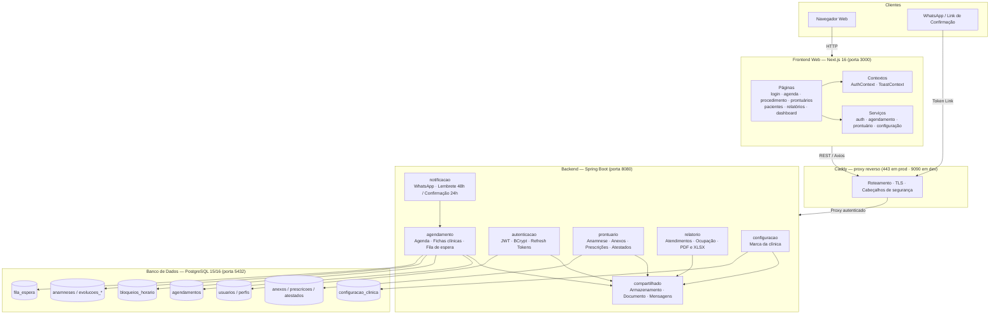
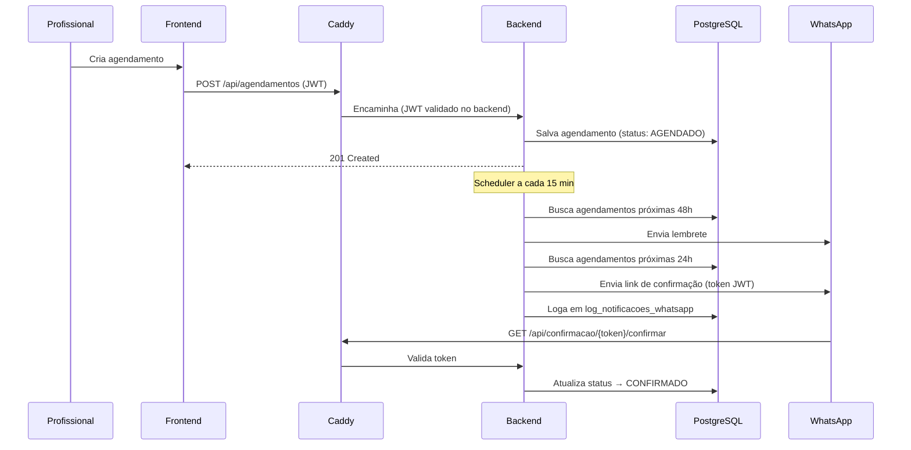
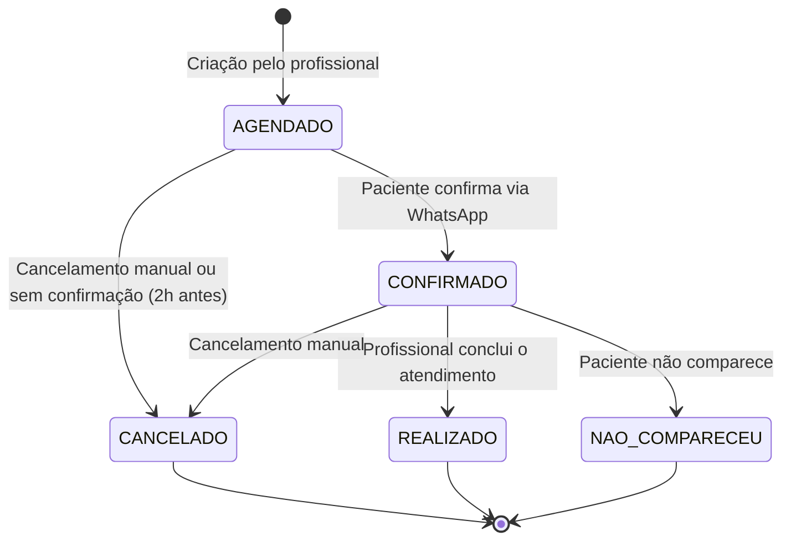
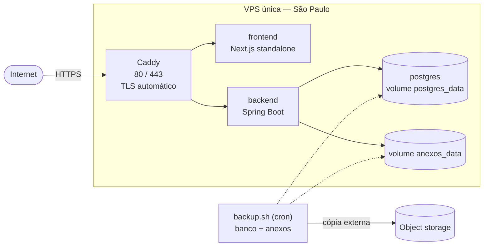

# 🩺 ProntuDigital


Sistema de prontuário eletrônico e agendamento para clínicas de enfermagem especializadas em **podologia** e **tratamento de feridas**. Permite o cadastro de pacientes, agendamento de consultas, registro de evoluções clínicas e envio automatizado de notificações via WhatsApp.

**Público-alvo:** clínicas de enfermagem de pequeno porte (2 a 5 profissionais). O sistema é distribuído em **modelo silo** — uma instalação por cliente, com banco próprio — e cada instalação é personalizada pela própria interface (nome, CNPJ, logo e rodapé dos documentos), sem recompilação.

---

## 📋 Índice

- [Funcionalidades](#-funcionalidades)
- [Arquitetura](#-arquitetura)
- [Tecnologias](#-tecnologias)
- [Estrutura do Projeto](#-estrutura-do-projeto)
- [Banco de Dados](#-banco-de-dados)
- [API REST](#-api-rest)
- [Autenticação & Segurança](#-autenticação--segurança)
- [Identidade Visual](#-identidade-visual)
- [Variáveis de Ambiente](#-variáveis-de-ambiente)
- [Executando o Projeto](#-executando-o-projeto)
- [Testes](#-testes)
- [Implantação](#-implantação)
- [Como Contribuir](#-como-contribuir)
- [Licença](#-licença)
- [Créditos e Referências](#-créditos-e-referências)

---

## ✨ Funcionalidades

**Autenticação e acesso**
- Login com JWT + refresh token, três perfis (Administrador, Profissional, Paciente)
- Recuperação de senha por código

**Agenda**
- Agendamento com validação contra o expediente cadastrado do profissional
- Visualização por dia, semana e mês
- Bloqueios pontuais e recorrentes; lista de espera para remarcação
- Expediente e bloqueio recorrente são validados um contra o outro: o sistema recusa a combinação que zeraria o dia (intervalo de almoço e demais coberturas parciais continuam válidos)
- Confirmação por **WhatsApp** com link tokenizado; cancelamento automático de não confirmados

**Prontuário eletrônico**
- Anamnese completa (histórico, comorbidades, medicamentos, mobilidade)
- Ficha de Evolução de Enfermagem e Ficha de Evolução Diária de Curativos, com validação de campos obrigatórios ao finalizar a consulta
- Anexos de exames e documentos (imagem/PDF), prescrições e histórico clínico
- Atestados de comparecimento e afastamento em PDF
- Anexos, prescrições e atestados ficam disponíveis **nos dois pontos de uso**: nas abas do prontuário do paciente e como seções da tela de atendimento, para serem registrados durante a própria consulta

**Relatórios**
- Atendimentos e taxa de ocupação, exportáveis em PDF e XLSX

**Administração**
- Cadastro de usuários e de procedimentos
- **Configuração da clínica**: identificação, endereço, logo e rodapé aplicados aos documentos e à tela de login

---

## 🏗 Arquitetura

O ProntuDigital adota uma arquitetura em três camadas: **proxy reverso na borda**, **backend monolítico modular** e **frontend Next.js**. Todo o tráfego externo entra pelo **Caddy**, que termina o TLS e roteia entre frontend e backend — o backend nunca é publicado diretamente.

> A **autenticação é validada no backend** (`JWTFilter` + `@PreAuthorize` + policies de permissão), não na borda. O proxy não inspeciona o token: como o backend só é alcançável através dele, não há caminho que escape do filtro.



### Fluxo de Agendamento e Notificações WhatsApp



### Ciclo de Vida do Agendamento



---

## 🛠 Tecnologias

### Backend — `backend/`

| Tecnologia | Versão | Função |
|---|---|---|
| Java | 21 (LTS) | Linguagem principal |
| Spring Boot | 3.5.3 | Framework de aplicação |
| Spring Security | Incluído no Boot | Autenticação e autorização |
| Spring Data JPA | Incluído no Boot | ORM e repositórios |
| JJWT | 0.11.5 | Geração e validação de tokens JWT (HS512) |
| Flyway | Incluído no Boot | Migrações versionadas de banco de dados |
| PostgreSQL Driver | Incluído no Boot | Conexão com banco |
| SpringDoc OpenAPI | — | Documentação Swagger UI |
| Maven | 3.x (wrapper incluso) | Build e gerenciamento de dependências |

### Borda — Caddy

| Tecnologia | Versão | Função |
|---|---|---|
| Caddy | 2 (alpine) | Proxy reverso, TLS automático, cabeçalhos de segurança |

> O módulo `gateway/` (Spring Cloud Gateway) foi **substituído pelo Caddy** em dev e em
> produção. Ele fazia apenas roteamento e CORS: o Caddy faz o primeiro e elimina o
> segundo, servindo frontend e API no mesmo domínio. A troca ainda dispensa uma JVM
> (~300 MB e ~30 s de boot) e trouxe TLS de graça.

### Frontend Web — `frontend-web/`

| Tecnologia | Versão | Função |
|---|---|---|
| Next.js | 16.0.1 | Framework React com App Router |
| React | 19.2.0 | Biblioteca de UI |
| TypeScript | 5.x | Tipagem estática |
| Tailwind CSS | 4.x | Estilização utilitária |
| Axios | 1.13.2 | Cliente HTTP com interceptors (refresh token) |
| Lucide React | — | Ícones |
| Font Awesome | — | Ícones |
| ESLint + Prettier | — | Lint e formatação de código |
| npm | — | Gerenciador de pacotes |

### Infraestrutura

| Tecnologia | Função |
|---|---|
| PostgreSQL 15/16 | Banco de dados relacional |
| Docker + Docker Compose | Containerização e orquestração |
| Nginx | Servidor estático para build de produção do frontend |

---

## 📁 Estrutura do Projeto

```
prontudigital/
│
├── backend/                                 # API Java Spring Boot (monolito modular)
│   ├── src/main/java/com/prontudigital/backend/
│   │   ├── autenticacao/                    # Login, JWT, usuários e perfis
│   │   │   ├── config/                      # SecurityConfig (rotas públicas x autenticadas)
│   │   │   ├── controladores/               # AutenticacaoController, UsuarioController
│   │   │   ├── entidades/                   # Usuario, Perfil, RefreshToken, Endereco
│   │   │   ├── filtros/                     # JWTFilter
│   │   │   └── seguranca/                   # JwtTokenProvider, UsuarioContexto
│   │   ├── agendamento/                     # Agenda, bloqueios, fila de espera
│   │   │   ├── entidades/                   # Agendamento, EvolucaoCurativo, HorarioTrabalho…
│   │   │   ├── seguranca/                   # AgendamentoPermissaoPolicy
│   │   │   └── utils/                       # AgendamentoUtil (montagem de DTOs)
│   │   │                                    # ExpedienteEfetivo (expediente − bloqueios)
│   │   ├── prontuario/                      # PEP: anamnese, anexos, prescrições, atestados
│   │   │   └── seguranca/                   # ProntuarioPermissaoPolicy (RN03)
│   │   ├── relatorio/                       # RF19/RF20 + exportação PDF/XLSX
│   │   ├── notificacao/                     # Scheduler e integração WhatsApp Cloud API
│   │   ├── configuracao/                    # Dados e marca da clínica (white-label)
│   │   └── compartilhado/
│   │       ├── armazenamento/               # ArmazenamentoService (filesystem/volume)
│   │       ├── documento/                   # PdfBuilder, PlanilhaBuilder, MarcaDocumento
│   │       ├── excecoes/                    # GlobalExceptionHandler
│   │       └── mensagens/                   # Mensagens.get() + messages.properties
│   ├── src/main/resources/
│   │   ├── application.yaml                 # Base (porta 8080)
│   │   ├── application-local.yaml           # Backend rodando na IDE
│   │   ├── application-dev.yaml             # Container de desenvolvimento
│   │   ├── application-prod.yaml
│   │   ├── messages.properties              # Mensagens centralizadas (i18n)
│   │   └── db/migracoes/                    # Flyway V1–V28
│   ├── src/test/java/                       # 16 classes com Mockito + 1 @SpringBootTest
│   ├── Dockerfile.dev  ·  Dockerfile.prod
│   └── pom.xml
│
├── frontend-web/                            # Next.js 16 + React 19 (App Router)
│   ├── app/
│   │   ├── globals.css                      # PALETA DE CORES — fonte única
│   │   ├── login/                           # Entrada (exibe a marca da clínica)
│   │   ├── agendar/                         # Agendamento público
│   │   ├── agenda/                          # Agenda do profissional
│   │   │   └── procedimento/[id]/           # Atendimento: fichas clínicas, cadastro,
│   │   │                                    # anexos, prescrições e atestados
│   │   ├── minha-agenda/                    # Agenda do paciente
│   │   ├── pacientes/                       # Lista de pacientes
│   │   │   └── [pacienteUuid]/prontuario/   # PEP com abas (Histórico é exclusivo daqui)
│   │   ├── prontuarios/                     # Acesso direto ao prontuário
│   │   ├── bloqueios/  ·  relatorios/  ·  perfil/
│   │   ├── dashboard/                       # Área administrativa
│   │   │   ├── usuarios/  ·  procedimentos/
│   │   │   └── configuracoes/               # Marca e dados da clínica
│   │   └── api/auth/                        # Route Handlers (session, refresh)
│   ├── components/                          # Layout, Modal, Toast, SelectAutocomplete…
│   │   └── PainelProntuario/                # Anexos, prescrições e atestados —
│   │                                        # compartilhados entre o prontuário e
│   │                                        # a tela de atendimento (prop `variante`)
│   ├── contexts/                            # AuthContext, ToastContext
│   ├── lib/                                 # Serviços de API, máscaras, mensagens
│   ├── tipos/                               # Tipos TypeScript espelhando os DTOs
│   ├── Dockerfile.dev  ·  Dockerfile.prod
│   └── package.json
│
├── gateway/                                 # LEGADO — substituído pelo Caddy; não sobe
│
├── docker/
│   ├── dev/
│   │   ├── docker-compose.yml               # Stack de desenvolvimento com hot reload
│   │   ├── docker-compose.debug.yml         # Override: backend fora do container (IDE)
│   │   ├── Caddyfile
│   │   └── .env.dev.example
│   └── prod/
│       ├── docker-compose.prod.yml
│       ├── Caddyfile                        # TLS automático
│       ├── scripts/backup.sh                # RNF02 — banco + anexos
│       ├── scripts/restore.sh
│       └── .env.prod.example
│
├── ajustar_campos/                          # PDFs-modelo das fichas clínicas
├── .editorconfig                            # UTF-8 e indentação — ver nota em Testes
├── ANALISE_DEPLOY.md                        # Comparativo de plataformas de hospedagem
├── PLANO_PROXIMOS_PASSOS.md
├── Requisitos.md                            # RFs e RNFs
└── README.md
```

---

## 🗄 Banco de Dados

O esquema é gerenciado pelo **Flyway**: são **25 migrações**, numeradas de `V1` a `V28`,
em `backend/src/main/resources/db/migracoes/`. As versões **V14, V15 e V21 não existem** —
foram descartadas durante o desenvolvimento e as lacunas ficaram, porque renumerar
migração já aplicada quebraria o checksum do Flyway.

| Migration | Tabela / Alteração | Descrição |
|---|---|---|
| V1 | `usuarios` | Usuários com UUID, status ativo |
| V2 | `perfis` | Perfis (ADMIN, PROFISSIONAL, PACIENTE) |
| V3 | `usuario_perfis` | Relação N:N usuário–perfil |
| V4 | `refresh_tokens` | Tokens de sessão com controle de revogação |
| V5 | `agendamentos` | Agendamentos com status e tipo |
| V6 | `bloqueios_horario` | Bloqueios avulsos de horário |
| V7 | `fila_espera` | Fila para reagendamento automático |
| V8 | — | Dados de exemplo |
| V9 | `historico_agendamentos` | Audit log de mudanças de status |
| V10 | `log_notificacoes_whatsapp` | Log de notificações enviadas |
| V11 | `usuarios.acesso_ativado` | Flag de ativação de credenciais de paciente |
| V12 | `agendamentos.tipo_procedimento` | Tipo do procedimento (depois migrado para tabela) |
| V13 | `agendamentos.local_atendimento / paciente_acamado` | Local e status de mobilidade |
| V16 | `bloqueios_recorrentes` | Regras de bloqueio por dia da semana |
| V17 | `codigos_recuperacao_senha` | Códigos de recuperação de senha |
| V18 | `anamneses` | Anamnese do paciente (1:1) |
| V19 | `prescricoes` | Prescrições de medicamentos e cuidados |
| V20 | `anexos` | Metadados dos anexos (o binário fica em volume) |
| V22 | `procedimentos` | Procedimentos em tabela, substituindo o enum (RF06) |
| V23 | `evolucoes_enfermagem` | Ficha de Evolução de Enfermagem (avaliação) |
| V24 | `evolucoes_curativos` | Ficha de Evolução Diária – Curativos (tratamento) |
| V25 | `usuarios` (colunas) | CPF, endereço e COREN (RF04) |
| V26 | `horarios_trabalho` | Expediente semanal do profissional (RF05) |
| V27 | `atestados` | Atestados emitidos (RF17) |
| V28 | `configuracao_clinica` | Marca e dados da clínica (white-label) |

```mermaid
erDiagram
    USUARIOS {
        uuid id PK
        string nome
        string email
        string senha_hash
        string telefone
        boolean ativo
        boolean acesso_ativado
    }
    PERFIS {
        int id PK
        string nome
    }
    USUARIO_PERFIS {
        uuid usuario_id FK
        int perfil_id FK
    }
    REFRESH_TOKENS {
        uuid id PK
        uuid usuario_id FK
        string token
        timestamp expira_em
        boolean revogado
    }
    AGENDAMENTOS {
        uuid id PK
        uuid paciente_uuid FK
        uuid profissional_uuid FK
        timestamp inicio_em
        timestamp fim_em
        string status
        string tipo
        string tipo_procedimento
        string local_atendimento
        boolean paciente_acamado
        string observacoes
    }
    EVOLUCOES_ENFERMAGEM {
        uuid id PK
        uuid agendamento_id FK
        date data_avaliacao
        string localizacao_anatomica
        string tipo_ferida
        numeric comprimento
        numeric largura
        string tecido_leito
    }
    EVOLUCOES_CURATIVOS {
        uuid id PK
        uuid agendamento_id FK
        numeric comprimento
        numeric largura
        numeric area_aproximada
        string tecido
        string exsudato
        int dor_escala
        string evolucao
    }
    ANAMNESES {
        uuid id PK
        uuid paciente_uuid FK
        string motivo_consulta
        boolean diabetes_mellitus
        boolean hipertensao_arterial
        date data_inicio_aproximada
    }
    PRESCRICOES {
        uuid id PK
        uuid paciente_uuid FK
        string tipo
        string descricao
        string posologia
        timestamp criado_em
    }
    ANEXOS {
        uuid id PK
        uuid paciente_uuid FK
        string nome_original
        string tipo_conteudo
        bigint tamanho_bytes
        string chave_armazenamento
    }
    ATESTADOS {
        uuid id PK
        uuid paciente_uuid FK
        string tipo
        int dias_afastamento
        string cid
        timestamp criado_em
    }
    HORARIOS_TRABALHO {
        uuid id PK
        uuid profissional_uuid FK
        int dia_semana
        time hora_inicio
        time hora_fim
        boolean ativo
    }
    BLOQUEIOS_HORARIO {
        uuid id PK
        uuid profissional_uuid FK
        timestamp inicio_em
        timestamp fim_em
        string motivo
    }
    BLOQUEIOS_RECORRENTES {
        uuid id PK
        uuid profissional_uuid FK
        int dia_semana
        time hora_inicio
        time hora_fim
        string motivo
    }
    FILA_ESPERA {
        uuid id PK
        uuid paciente_uuid FK
        uuid profissional_uuid FK
        timestamp criado_em
    }
    HISTORICO_AGENDAMENTOS {
        uuid id PK
        uuid agendamento_id FK
        string status_anterior
        string status_novo
        timestamp alterado_em
    }
    LOG_NOTIFICACOES_WHATSAPP {
        uuid id PK
        uuid agendamento_id FK
        string tipo
        string status
        timestamp enviado_em
    }

    USUARIOS ||--o{ USUARIO_PERFIS : "possui"
    PERFIS ||--o{ USUARIO_PERFIS : "associado a"
    USUARIOS ||--o{ REFRESH_TOKENS : "tem"
    USUARIOS ||--o{ AGENDAMENTOS : "paciente"
    USUARIOS ||--o{ AGENDAMENTOS : "profissional"
    AGENDAMENTOS ||--o| EVOLUCOES_ENFERMAGEM : "avaliação"
    AGENDAMENTOS ||--o| EVOLUCOES_CURATIVOS : "tratamento"
    AGENDAMENTOS ||--o{ HISTORICO_AGENDAMENTOS : "registra"
    AGENDAMENTOS ||--o{ LOG_NOTIFICACOES_WHATSAPP : "gera"
    USUARIOS ||--o| ANAMNESES : "possui"
    USUARIOS ||--o{ PRESCRICOES : "recebe"
    USUARIOS ||--o{ ANEXOS : "possui"
    USUARIOS ||--o{ ATESTADOS : "recebe"
    USUARIOS ||--o{ BLOQUEIOS_HORARIO : "define"
    USUARIOS ||--o{ BLOQUEIOS_RECORRENTES : "define"
    USUARIOS ||--o{ HORARIOS_TRABALHO : "define"
    USUARIOS ||--o{ FILA_ESPERA : "entra em"
```



> As duas fichas clínicas são **1:1 com o agendamento e mutuamente exclusivas**: o
> tipo `AVALIACAO` grava em `evolucoes_enfermagem`, o `TRATAMENTO` em
> `evolucoes_curativos`, e o backend recusa a ficha que não corresponde ao tipo.
> Já a anamnese é **1:1 com o paciente**, não com a consulta — acompanha a pessoa
> e é editada a cada nova avaliação.
>
> As tabelas `procedimentos`, `configuracao_clinica` e `codigos_recuperacao_senha`
> ficaram fora do diagrama por não terem relacionamento com as demais.

---

## 🔌 API REST

O backend escuta na `8080`, mas os clientes chegam pelo Caddy: `9090` em desenvolvimento e `443` em produção. Documentação interativa em `http://localhost:9090/swagger-ui/index.html` — **aberta apenas em dev**; em produção o Swagger não é roteado.

### Autenticação — `/api/auth`

| Método | Endpoint | Descrição | Acesso |
|---|---|---|---|
| `POST` | `/registrar` | Cadastra profissional | Público |
| `POST` | `/login` | Autentica e retorna JWT + refresh token | Público |
| `POST` | `/renovar-token` | Renova o access token | Público |
| `POST` | `/logout` | Revoga sessão | Autenticado |
| `POST` | `/cadastrar-paciente` | Cadastra paciente (nome + telefone) | ADMIN / PROFISSIONAL |
| `POST` | `/ativar-acesso` | Ativa credenciais de paciente existente | ADMIN / PROFISSIONAL |

### Usuários — `/api/usuarios`

| Método | Endpoint | Descrição | Acesso |
|---|---|---|---|
| `GET` | `/me` | Dados do usuário autenticado | Autenticado |
| `GET` | `/` | Lista todos os usuários | ADMIN |
| `GET` | `/{id}` | Busca usuário por ID | ADMIN |
| `GET` | `/uuid/{uuid}` | Busca usuário por UUID | ADMIN / PROFISSIONAL |
| `PUT` | `/{id}` | Atualiza usuário completo | ADMIN |
| `PATCH` | `/{id}/perfil` | Atualiza nome, e-mail, telefone | Autenticado |
| `PATCH` | `/{id}/senha` | Altera senha | Autenticado |
| `DELETE` | `/{id}` | Remove usuário | ADMIN |

### Agendamentos — `/api/agendamentos`

| Método | Endpoint | Descrição | Acesso |
|---|---|---|---|
| `POST` | `/` | Cria agendamento | ADMIN / PROFISSIONAL |
| `GET` | `/{id}` | Detalha agendamento | Autenticado |
| `GET` | `/agenda?data=DATE&tipo=DIA\|SEMANA\|MES` | Agenda por período | PROFISSIONAL |
| `GET` | `/meus` | Agendamentos do paciente logado | PACIENTE |
| `GET` | `/avaliacoes/{id}/tratamentos` | Tratamentos vinculados a uma avaliação | Autenticado |
| `GET` | `/pacientes` | Pacientes com agendamentos nos últimos 3 meses (paginado) | ADMIN / PROFISSIONAL |
| `PATCH` | `/{id}/confirmar` | Confirma presença | PACIENTE / PROFISSIONAL |
| `PATCH` | `/{id}/cancelar` | Cancela agendamento | Autenticado |
| `PATCH` | `/{id}/reagendar` | Reagenda para nova data/hora | PROFISSIONAL |
| `PATCH` | `/{id}/concluir` | Marca como realizado | PROFISSIONAL |
| `PATCH` | `/{id}/evolucao-enfermagem` | Registra a Ficha de Evolução de Enfermagem (só `AVALIACAO`) | PROFISSIONAL |
| `PATCH` | `/{id}/evolucao-curativo` | Registra a Ficha de Evolução Diária – Curativos (só `TRATAMENTO`) | PROFISSIONAL |

### Procedimentos — `/api/procedimentos`

| Método | Endpoint | Descrição | Acesso |
|---|---|---|---|
| `GET` | `/` | Lista procedimentos ativos (`?incluirInativos=true` inclui os desativados) | Público |
| `GET` | `/{id}` | Detalha procedimento | Público |
| `POST` | `/` | Cria procedimento | ADMIN |
| `PUT` | `/{id}` | Atualiza procedimento (inclui ativar/desativar) | ADMIN |
| `DELETE` | `/{id}` | Remove procedimento sem vínculos | ADMIN |

### Prontuário — `/api/prontuario/pacientes/{pacienteUuid}`

Todos os endpoints aplicam a **RN03** via `ProntuarioPermissaoPolicy`:

- **Leitura** (`podeVisualizar`): ADMIN sempre; PROFISSIONAL só de pacientes que já
  atendeu; PACIENTE só o próprio prontuário.
- **Escrita** (`podeEditar`): ADMIN e PROFISSIONAL vinculado — o paciente nunca edita
  dados clínicos.

| Método | Endpoint | Descrição | Acesso |
|---|---|---|---|
| `GET` | `/historico` | Histórico clínico consolidado (timeline) | RN03 leitura |
| `GET` | `/anamnese` | Anamnese do paciente (1:1) | RN03 leitura |
| `POST` | `/anamnese` | Registra anamnese | RN03 escrita |
| `PUT` | `/anamnese` | Atualiza anamnese | RN03 escrita |
| `GET` | `/prescricoes` | Lista prescrições | RN03 leitura |
| `POST` | `/prescricoes` | Cria prescrição | RN03 escrita |
| `PUT` | `/prescricoes/{uuid}` | Atualiza prescrição | RN03 escrita |
| `DELETE` | `/prescricoes/{uuid}` | Remove prescrição | RN03 escrita |
| `GET` | `/anexos` | Lista anexos | RN03 leitura |
| `POST` | `/anexos` | Upload `multipart/form-data` (JPG/PNG/WEBP/PDF, 10 MB) | RN03 escrita |
| `GET` | `/anexos/{uuid}/conteudo` | Stream do arquivo (inline) | RN03 leitura |
| `DELETE` | `/anexos/{uuid}` | Remove anexo | RN03 escrita |
| `GET` | `/atestados` | Lista atestados emitidos (RF17) | RN03 leitura |
| `POST` | `/atestados` | Emite atestado | RN03 escrita |
| `GET` | `/atestados/{uuid}/pdf` | PDF do atestado, regerado a cada chamada | RN03 leitura |
| `DELETE` | `/atestados/{uuid}` | Remove atestado | RN03 escrita |

O PDF do atestado **não é persistido**: é regerado a partir do registro sempre que
solicitado, então o registro é a fonte da verdade. `AFASTAMENTO` exige
`diasAfastamento`; `COMPARECIMENTO` o recusa (422).

### Relatórios — `/api/relatorios`

ADMIN pode omitir `profissionalUuid` para ver a clínica inteira; PROFISSIONAL só
consulta a própria agenda (pedir outra retorna 403); PACIENTE não acessa.

| Método | Endpoint | Descrição | Acesso |
|---|---|---|---|
| `GET` | `/atendimentos?inicio=&fim=[&profissionalUuid=&status=&tipo=]` | Atendimentos do período com totais por status e tipo (RF19) | ADMIN / PROFISSIONAL |
| `GET` | `/ocupacao?inicio=&fim=[&profissionalUuid=]` | Comparecimento, cancelamentos e ocupação da agenda (RF20) | ADMIN / PROFISSIONAL |
| `GET` | `/atendimentos/exportar?...&formato=PDF\|XLSX` | Mesmo relatório como arquivo (RF21) | ADMIN / PROFISSIONAL |
| `GET` | `/ocupacao/exportar?...&formato=PDF\|XLSX` | Mesmo relatório como arquivo (RF21) | ADMIN / PROFISSIONAL |

Sobre as taxas de `/ocupacao`: comparecimento e absenteísmo são calculados sobre
os atendimentos que **chegaram a acontecer** (realizados + faltas) — o que foi
cancelado antes nunca virou presença nem falta. A taxa de cancelamento é sobre o
total. Todas vêm `null` quando não há base de comparação, em vez de zero.
`taxaOcupacao` compara as horas ocupadas com o expediente do RF05 e exige um
profissional filtrado que tenha horários cadastrados; caso contrário vem `null`.

### Horários de Trabalho — `/api/horarios-trabalho`

Expediente semanal do profissional (RF05). Alimenta a validação de disponibilidade:
um agendamento precisa caber inteiro em uma janela do dia da semana. Profissional
**sem nenhuma janela cadastrada não é restringido** — a regra só passa a valer
depois que o expediente é definido.

| Método | Endpoint | Descrição | Acesso |
|---|---|---|---|
| `POST` | `/` | Cria janela de atendimento (422 se um bloqueio recorrente já cobrir o intervalo inteiro) | ADMIN / PROFISSIONAL (própria agenda) |
| `GET` | `/?profissionalUuid=` | Lista janelas do profissional | Autenticado |
| `GET` | `/public?profissionalUuid=` | Idem, para a tela pública de agendamento | Público |
| `DELETE` | `/{id}` | Remove janela | ADMIN / PROFISSIONAL (própria agenda) |

### Bloqueios de Horário — `/api/bloqueios-horario`

Tanto os bloqueios avulsos quanto as **regras recorrentes** são checados ao agendar
e ao reagendar: a regra semanal é materializada nos dias do período antes da
comparação.

| Método | Endpoint | Descrição | Acesso |
|---|---|---|---|
| `POST` | `/` | Cria bloqueio avulso | PROFISSIONAL |
| `GET` | `/` | Lista bloqueios por profissional/período | PROFISSIONAL |
| `DELETE` | `/{id}` | Remove bloqueio | PROFISSIONAL |
| `GET` | `/public` | Lista pública (sem autenticação) | Público |
| `POST` | `/recorrentes` | Cria regra recorrente por dia da semana (422 se zerar o expediente) | PROFISSIONAL |
| `GET` | `/recorrentes` | Lista regras recorrentes | PROFISSIONAL |
| `DELETE` | `/recorrentes/{id}` | Remove regra recorrente | PROFISSIONAL |

#### Coerência entre expediente e bloqueio

As duas tabelas são cadastradas por telas diferentes e, ao agendar, são aplicadas
em **AND**: o atendimento precisa caber no expediente **e** não colidir com bloqueio.
Nada impedia, porém, gravar um par que se autoanula — expediente de sábado
08:00–18:00 com folga recorrente de sábado 08:00–18:00. O agendamento não quebrava
(o bloqueio vence), mas o sábado ficava inteiro inagendável enquanto a tela seguia
anunciando expediente.

`ExpedienteEfetivo` (em `agendamento/utils/`) subtrai os bloqueios das janelas de
expediente, e os dois serviços recusam a operação que não deixa **nenhum minuto útil**
no dia. A verificação considera as regras já existentes, porque duas folgas de meio
período são legítimas isoladamente e anulam o dia quando somadas.

Duas coisas continuam permitidas de propósito: **cobertura parcial** — o intervalo
de almoço é o caso de uso do bloqueio recorrente — e **regra em dia sem expediente
cadastrado**, já que aí não há o que anular e o bloqueio é a única proteção do
profissional que nunca definiu expediente.

### Confirmação WhatsApp — `/api/confirmacao` (Público)

| Método | Endpoint | Descrição |
|---|---|---|
| `GET` | `/{token}/confirmar` | Confirma agendamento via link enviado pelo WhatsApp |
| `GET` | `/{token}/recusar` | Recusa e insere o paciente na fila de espera |

---

### Configuração da Clínica — `/api/configuracao`

| Método | Rota | Acesso | Descrição |
|---|---|---|---|
| `GET` | `/api/configuracao` | **Público** | Nome, CNPJ, endereço e rodapé da clínica |
| `PUT` | `/api/configuracao` | ADMIN | Atualiza os dados |
| `GET` | `/api/configuracao/logo` | **Público** | Binário da logo (`inline`) |
| `POST` | `/api/configuracao/logo` | ADMIN | Envia a logo (JPG/PNG/WEBP, até 2 MB) |
| `DELETE` | `/api/configuracao/logo` | ADMIN | Remove a logo |

> A **leitura é pública** de propósito: a tela de login e o agendamento público
> exibem a marca antes da autenticação, e um `` não envia o header
> `Authorization`. São dados institucionais — os mesmos que a clínica publica no
> próprio site. A escrita permanece restrita ao ADMIN via `@PreAuthorize`.

---

## 🔐 Autenticação & Segurança

- **Algoritmo JWT**: HS512 (HMAC com SHA-512)
- **Tokens**: access token + refresh token com rotação por revogação no logout
- **Armazenamento de refresh tokens**: persistidos no banco com controle de expiração
- **Codificação de senhas**: BCrypt
- **Sessão**: stateless — sem HttpSession
- **Controle de acesso**: `@PreAuthorize` por perfil em cada endpoint
- **CORS**: inexistente em produção — o Caddy serve frontend e API no mesmo domínio, então as chamadas são same-origin. Em dev, o Caddy libera as origens `localhost` para permitir abrir o app direto em `:3000`
- **Isolamento**: em produção só o Caddy publica portas; backend e Postgres ficam numa rede Docker `internal: true`, inalcançáveis de fora do host

### Perfis de Usuário

| Perfil | Capacidades |
|---|---|
| `ADMIN` | Gestão completa de usuários, acesso a todos os dados |
| `PROFISSIONAL` | Agenda, agendamentos, bloqueios, evoluções clínicas |
| `PACIENTE` | Visualiza próprios agendamentos, confirma presença |

---

## 🎨 Identidade Visual

Todas as cores do frontend vêm de **uma fonte única**: o bloco `:root` de
`frontend-web/app/globals.css`, com **118 tokens** organizados por função
(marca, superfícies, texto, bordas, status, tipos de agendamento, neutros).

```css
/* uso em qualquer arquivo CSS */
background: var(--color-bg-page);
color: var(--color-text-heading);

/* transparência precisa dos componentes RGB soltos —
   rgba() não aceita um hex vindo de variável */
box-shadow: 0 2px 6px rgba(var(--color-brand-rgb), 0.06);
```

**Regras**

- Nenhum hex literal, `rgb()` com número cru ou classe Tailwind `bg-[#xxxxxx]`
- Nenhum `var(--token, #fallback)`: o fallback duplica o valor e diverge com o tempo
- Cor nova só entra virando **token nomeado** em `globals.css`

Verificação rápida — o resultado esperado é vazio:

```bash
cd frontend-web
grep -rnE "#[0-9a-fA-F]{3,8}" --include=*.css --include=*.tsx app components   | grep -v "app/globals.css"
```

> A personalização por cliente (logo, nome, CNPJ, rodapé) é **dado**, não código:
> fica em `configuracao_clinica` e é editada em `/dashboard/configuracoes`. A
> paleta é a identidade do produto; a marca é a do cliente.

---

## ⚙️ Variáveis de Ambiente

### Raiz do Projeto — `.env.example`

```env
# PostgreSQL
PG_HOST=localhost
PG_PORT=5432
PG_DB=prontudigital
PG_USER=user_admin
PG_PASSWORD=secret123
```

### Backend — `application.yaml`

```env
# Banco de dados
SPRING_DATASOURCE_URL=jdbc:postgresql://<host>:5432/prontudigital
SPRING_DATASOURCE_USERNAME=user
SPRING_DATASOURCE_PASSWORD=senha

# JWT (alterar em produção!)
APP_JWT_SECRET=<chave-aleatoria-minimo-64-caracteres>
APP_JWT_ACCESS_EXPIRATION_MS=900000         # 15 min recomendado em prod
APP_JWT_REFRESH_EXPIRATION_MS=604800000     # 7 dias

# Flyway
SPRING_FLYWAY_URL=jdbc:postgresql://<host>:5432/prontudigital
SPRING_FLYWAY_USER=user
SPRING_FLYWAY_PASSWORD=senha
```

### Borda — `docker/{dev,prod}/Caddyfile`

Não tem `.env` próprio. O único parâmetro é o domínio, em produção:

```env
DOMINIO=prontudigital.com.br    # sem https:// e sem barra final
```

### Frontend — `next.config.ts`

```env
NEXT_PUBLIC_API_URL=http://localhost:9090
```

> **Atenção em produção**: substitua `APP_JWT_SECRET` por uma chave aleatória forte e reduza `APP_JWT_ACCESS_EXPIRATION_MS` para no máximo 15 minutos.

---

## 🚀 Executando o Projeto

### Pré-requisitos

- Docker 24+ e Docker Compose v2
- _(Sem Docker)_ Java 21, Maven 3.9+, Node.js 20+, PostgreSQL 15+

### Desenvolvimento com Docker (recomendado)

```bash
# 1. Clone o repositório
git clone <url-do-repositorio>
cd prontudigital

# 2. Configure as variáveis de ambiente
cp docker/dev/.env.dev.example docker/dev/.env

# 3. Suba o stack completo com hot-reload
cd docker/dev
docker compose up
```

| Entrada | URL | Observação |
|---|---|---|
| **App (recomendado)** | http://localhost:9090 | Caddy — same-origin, igual à produção |
| Frontend direto | http://localhost:3000 | Next.js; o Caddy libera CORS para esta origem |
| Backend direto | http://localhost:8080 | Debug; em produção **não** é publicado |
| Swagger | http://localhost:9090/swagger-ui/index.html | Aberto só em dev |
| PostgreSQL | localhost:5432 | Para DBeaver/IntelliJ |

> Dev e produção usam o **mesmo proxy (Caddy)** e o mesmo roteamento — ver
> `docker/dev/Caddyfile` e `docker/prod/Caddyfile`. As duas diferenças são
> propositais: dev não tem TLS e libera CORS (porque o app pode ser aberto em
> `:3000`, origem diferente da API em `:9090`); produção não precisa de CORS
> porque serve tudo no mesmo domínio.

### Debug do backend no IntelliJ

Com o Spring Cloud Gateway aposentado, o proxy só existe como container — mas o
**backend** pode continuar rodando na IDE, com breakpoints e hot swap nativos. O
override `docker/dev/docker-compose.debug.yml` sobe Postgres, Caddy e frontend em
container e deixa a porta `8080` livre para a JVM do IntelliJ:

```bash
cd docker/dev
docker compose -f docker-compose.yml -f docker-compose.debug.yml up -d
```

Depois, no IntelliJ, dê **Debug** em `BackendApplication` com `Active profiles: local`
— esse profile aponta para `localhost:5432`, que é a porta publicada pelo container
do Postgres. A entrada continua sendo http://localhost:9090.

O que o override muda: o serviço `backend` fica desativado (profile `nunca` do
compose), o Caddy passa a resolver o host `backend` para a máquina host via
`extra_hosts: backend:host-gateway` — então o `Caddyfile` **não muda** — e o
`BACKEND_INTERNAL_URL` do frontend (usado pelos Route Handlers do Next, que rodam
dentro do container) aponta para `host.docker.internal:8080`.

> Na primeira execução o Windows pode pedir liberação de firewall para o Java
> aceitar conexões — sem isso o Caddy não alcança o backend da IDE.

Para voltar a rodar tudo em container, basta omitir o arquivo de override
(`docker compose up`).

### Produção com Docker

```bash
cd docker/prod
cp .env.prod.example .env          # preencha TODOS os valores
docker compose -f docker-compose.prod.yml up -d --build
```

> Sobe quatro serviços: **Postgres**, **backend** (Spring Boot), **frontend**
> (Next.js standalone — servidor Node, não build estático) e **Caddy**, que faz proxy
> reverso e TLS automático. O Spring Cloud Gateway **não** é usado em produção: o Caddy
> serve frontend e API no mesmo domínio, o que elimina o CORS. Só o Caddy publica portas
> (80/443); o Postgres não é alcançável de fora do host.

**Antes de considerar o deploy concluído**, configure o backup: veja
[`docker/prod/scripts/README.md`](docker/prod/scripts/README.md). O banco sozinho não
basta — os anexos do prontuário ficam em volume, fora dele.

### Sem Docker (local)

```bash
# 1. Inicie o PostgreSQL na porta 5432

# 2. Backend (nova aba)
cd backend
./mvnw spring-boot:run -Dspring-boot.run.profiles=local

# 3. Frontend (nova aba)
cd frontend-web
npm install
npm run dev
```

> Sem Docker não há proxy: o frontend em `:3000` chama o backend em `:8080`, que são
> origens diferentes. Aponte as variáveis para a porta do backend, por exemplo
> `NEXT_PUBLIC_API_URL=http://localhost:8080` — e note que o backend **não tem
> configuração de CORS**, justamente porque em dev e prod ele fica atrás do Caddy.
> Para o fluxo completo, prefira `docker/dev`.

---

## 🧪 Testes

**331 testes** no backend, em 19 classes:

- **16 classes unitárias com Mockito** cobrindo os *service impls*
- `ExpedienteEfetivoTest` — subtração de janelas entre expediente e bloqueios
- `MensagensTest` — guarda o encoding do `messages.properties` (ver nota abaixo)
- `ProntudigitalApplicationTests` — `@SpringBootTest`, valida a subida do contexto

Os testes usam **H2 em memória** com `MODE=PostgreSQL` (perfil `test`), com Flyway
desativado e `ddl-auto: create-drop` — não tocam o banco de desenvolvimento.

```bash
cd backend
./mvnw test                       # suíte completa
./mvnw test -Dtest=NomeDoTeste    # uma classe
./mvnw test jacoco:report         # relatório em target/site/jacoco/index.html
```

Cobertura atual (JaCoCo): **74,8% das instruções**, sendo **91,5% na camada
`servicos.impl`**. Os controllers aparecem baixos porque a estratégia é testar a
camada de serviço — não há testes de `@WebMvcTest`. O `AgendamentoUtil`
(`agendamento/utils/`) é o maior ponto descoberto do projeto, com ~2% das
instruções cobertas: ele monta DTOs e só é exercitado indiretamente.

> A suíte imprime linhas `ERROR` do logger durante a execução (*"API fora do ar"*,
> *"disco cheio"*). São esperadas: os testes de caminho de falha provocam essas
> condições de propósito. O que importa é o `BUILD SUCCESS` ao final.

**Sobre o `MensagensTest`:** o `messages.properties` concentra as mensagens em
pt-BR exibidas ao usuário e já teve dezenas de acentos corrompidos em U+FFFD. O
teste lê o arquivo como UTF-8 e falha se o caractere de substituição reaparecer.
Se você editar esse arquivo com um editor configurado em ANSI/Windows-1252, a
suíte vai acusar — é o comportamento desejado. O `.editorconfig` na raiz existe
justamente para evitar isso.

### Frontend

```bash
cd frontend-web
npx tsc --noEmit    # verificação de tipos
npx eslint app components lib tipos
npx next build      # build de produção (valida também o CSS)
```

---

## 🚢 Implantação

O comparativo de plataformas de hospedagem — silo vs. schema vs. pool, custos,
latência e implicações de LGPD — está em **[`ANALISE_DEPLOY.md`](ANALISE_DEPLOY.md)**.

**Resumo:** para uma clínica com poucos profissionais, uma **VPS única em São
Paulo rodando o `docker-compose.prod.yml`** entrega o melhor custo-benefício. A
conteinerização já resolve rede interna isolada, TLS automático, healthcheck e
limites de recurso; um PaaS cobraria mais para desmontar esse arranjo.



**Dois cuidados operacionais:**

1. **Não construa as imagens no servidor.** O `--build` compila Maven *e* roda
   `next build`, consumindo bem mais RAM que o runtime. Construa em CI, publique
   num registry e deixe a VPS apenas puxar — com isso 2 GB bastam.
2. **Backup fora da máquina.** O `scripts/backup.sh` já exporta banco e anexos na
   ordem correta (banco primeiro: o pior caso vira arquivo órfão, não download
   quebrado). Falta apenas o destino externo.

---

## 🤝 Como Contribuir

1. Crie um branch a partir de `develop`: `git checkout -b feat/nome-da-feature`
2. Siga as convenções abaixo
3. Garanta que `./mvnw test`, `npx tsc --noEmit` e `npx eslint` passam
4. Abra um Pull Request descrevendo **o que** mudou e **por quê**

**Convenções do projeto**

| Área | Regra |
|---|---|
| Idioma do código | Português para domínio (`Agendamento`, `buscarPorUuid`); inglês só onde o framework impõe |
| Mensagens ao usuário | Nunca literais no código — use `Mensagens.get()` (backend) e `MENSAGENS` (frontend) |
| Cores | Nunca hex literal — sempre `var(--color-*)` de `app/globals.css` |
| Migrações | **Nunca edite uma migração já aplicada** em ambiente compartilhado; crie a próxima versão |
| Encoding | UTF-8 em todos os arquivos. O `.editorconfig` da raiz declara isso — no VS Code, exige a extensão *EditorConfig for VS Code*; IntelliJ e Eclipse leem sem plugin |
| Commits | Mensagem no imperativo, descrevendo o efeito (`Valida campos obrigatórios ao finalizar consulta`) |
| Testes | Todo `ServiceImpl` novo nasce com classe de teste correspondente |

---

## 📄 Licença

Software **proprietário**. Todos os direitos reservados.
Uso, cópia ou distribuição requerem autorização expressa dos autores.

---

## 🙏 Créditos e Referências

**Bibliotecas de terceiros**

| Projeto | Uso |
|---|---|
| [Spring Boot](https://spring.io/projects/spring-boot) | Framework do backend |
| [Next.js](https://nextjs.org/) · [React](https://react.dev/) | Frontend |
| [Caddy](https://caddyserver.com/) | Proxy reverso e TLS automático |
| [Flyway](https://flywaydb.org/) | Versionamento do schema |
| [OpenPDF](https://github.com/LibrePDF/OpenPDF) · [Apache POI](https://poi.apache.org/) | Geração de PDF e XLSX |
| [JJWT](https://github.com/jwtk/jjwt) | Tokens JWT |
| [Lucide](https://lucide.dev/) | Ícones |

**Fichas clínicas**

Os modelos de Anamnese, Evolução de Enfermagem e Evolução Diária de Curativos
seguem os PDFs de referência em `ajustar_campos/modelos/`. A avaliação de ferida
adota a legenda **TIME** (*Tissue, Infection/inflammation, Moisture, Edge*),
padrão consolidado na literatura de cuidado com feridas.

**Conformidade**

O sistema trata **dados de saúde**, classificados como sensíveis pelo Art. 11 da
[LGPD](https://www.planalto.gov.br/ccivil_03/_ato2015-2018/2018/lei/l13709.htm).
As decisões de arquitetura e hospedagem levam isso em conta — ver
[`ANALISE_DEPLOY.md`](ANALISE_DEPLOY.md).

---

## 📌 Notas de Desenvolvimento

- **Migrações Flyway nunca devem ser editadas depois de aplicadas** em ambiente
  compartilhado — crie a próxima versão. (Enquanto o projeto não tem produção, a
  equipe optou por corrigir as migrações de criação e recriar o banco local.)
- O `application-local.yaml` (IDE) **não define `ddl-auto`**, então não valida o
  schema; `dev` e `prod` usam `validate` e recusam subir com divergência. Um tipo
  errado só aparece no container — vale rodar o backend em Docker antes de subir.
- O segredo JWT precisa de **64 caracteres**: HS512 exige 512 bits (RFC 7518
  §3.2). Abaixo disso a aplicação sobe e só falha no login — por isso o
  `JwtTokenProvider` agora derruba o boot com mensagem explícita.
- O scheduler de WhatsApp roda a cada **15 minutos**, verificando as próximas 48h
  (lembrete) e 24h (confirmação). Não confirmados são cancelados 2h antes.
- Anexos ficam em **volume**, não no banco: o `ArmazenamentoService` grava o
  arquivo e a tabela guarda só a chave. Backup de banco sem os anexos produz
  prontuário com download quebrado — o `backup.sh` cobre os dois.
- No Windows, criar uma **rota nova** exige reiniciar o container do frontend: o
  watcher do Turbopack não recebe eventos de criação de diretório pelo bind mount.
- O `messages.properties` é UTF-8 **sem BOM**. Não adicione BOM para "consertar" a
  exibição em editores: o `java.util.Properties` não trata o BOM como espaço em
  branco e ele viraria parte da primeira chave. O caminho é configurar o editor —
  ver a linha *Encoding* em [Como Contribuir](#-como-contribuir).
- As migrações pulam **V14, V15 e V21**. É intencional; não reaproveite esses
  números, porque um ambiente que já rodou as versões seguintes não aplicaria uma
  migração anterior sem `outOfOrder`.
