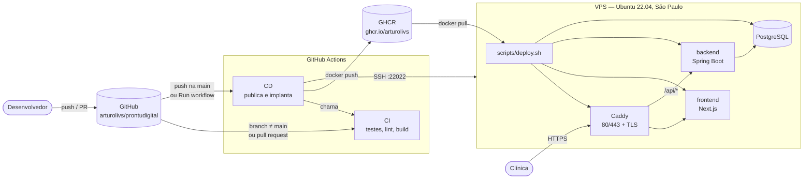
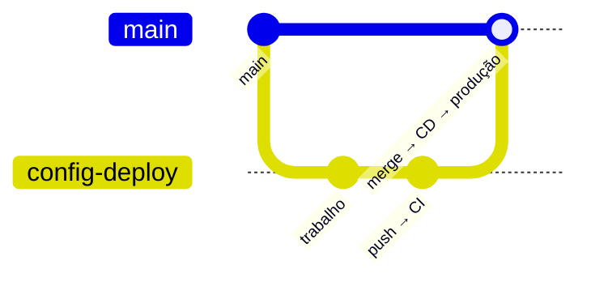
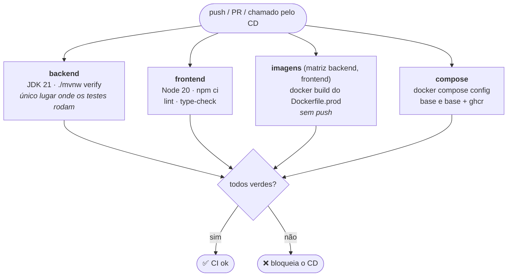
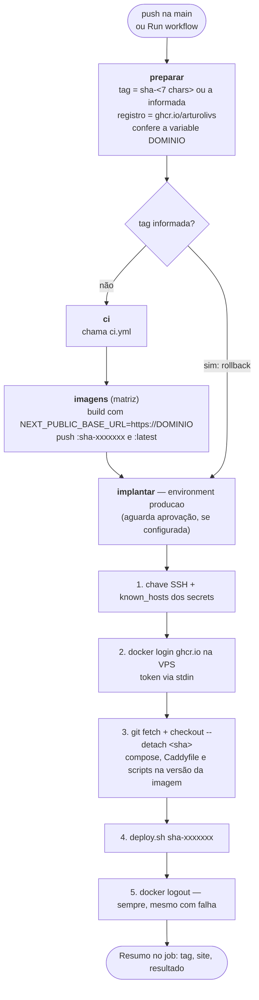
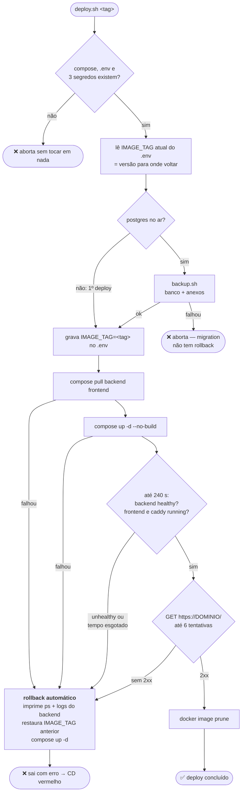
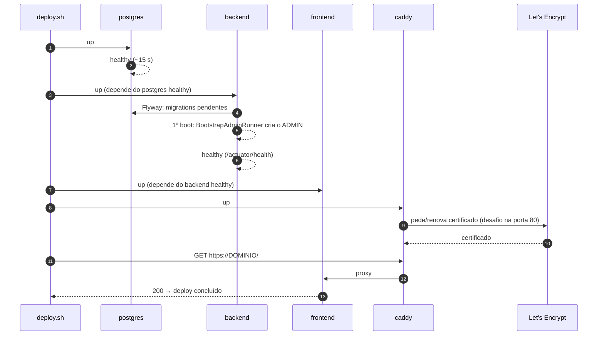
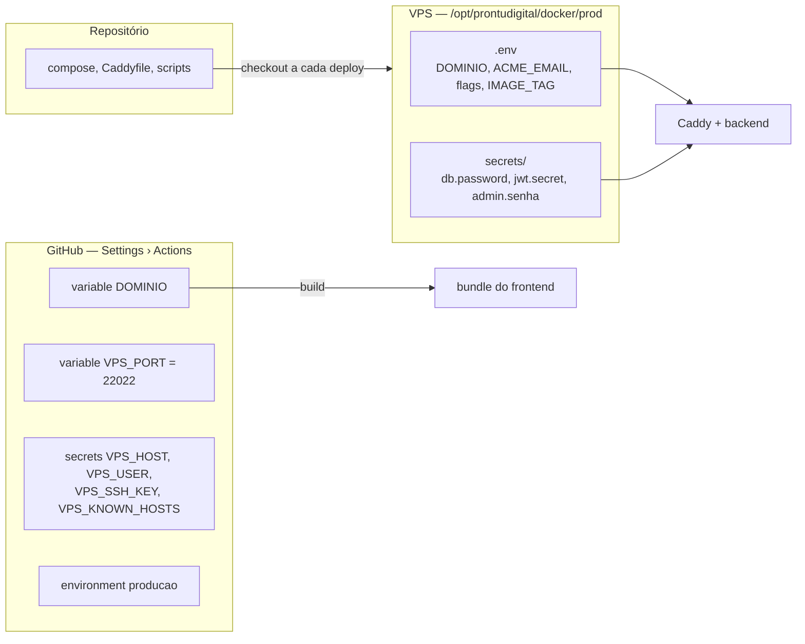

# Fluxo de deploy e pipelines CI/CD — ProntuDigital

> **Visão de cima.** Do commit até o sistema no ar em
> `https://purpleclin.prontudigital.com.br`, em diagramas. Descreve o estado do
> repositório em **01/10/2026**.
>
> Esta página mostra *o caminho*. Os detalhes estão nos vizinhos:
>
> | Documento | Para quê |
> |---|---|
> | [`DEPLOY.md`](./DEPLOY.md) | Preparar a VPS do zero e operar no dia a dia |
> | [`CICD.md`](./CICD.md) | Secrets, variables e o que fazer quando o pipeline falha |
> | [`GITHUB_ACTIONS.md`](./GITHUB_ACTIONS.md) | `ci.yml` e `cd.yml` lidos comando por comando |

---

## 1. Visão geral

As três regras que explicam o desenho:

1. **Nada é compilado na VPS.** Maven e `next build` consomem mais memória que
   o sistema inteiro em execução e derrubariam uma máquina de 4 GB. A
   compilação acontece no Actions, e a VPS só baixa a imagem pronta.
2. **Nada chega à produção sem passar pelo CI.** O CD chama o mesmo `ci.yml`
   antes de publicar imagem. Não há atalho.
3. **O deploy é um script, não o workflow.** O `deploy.sh` vive no repositório
   (e portanto na VPS). O workflow só o invoca por SSH, e o mesmo comando roda
   à mão quando o GitHub estiver fora do ar.

---

## 2. Branches e gatilhos

| Evento | Workflow | Resultado |
|---|---|---|
| Push em qualquer branch **exceto** `main` | CI | Testes e validação. Nada é publicado |
| Pull request (qualquer destino) | CI | Idem, com o resultado aparecendo no PR |
| Push na `main` | CD (que chama o CI) | Imagens publicadas **e deploy em produção** |
| *Actions > CD > Run workflow*, campo `tag` vazio | CD completo | Igual ao push na `main`, a partir do commit escolhido |
| *Actions > CD > Run workflow*, `tag` preenchida | CD só com deploy | Pula CI e build; implanta uma imagem já publicada. **É o rollback** |
| Dependabot (mensal) | CI, via PR | PRs de atualização de Maven, npm, imagens base e actions |

**Mudança só de documentação não faz deploy.** O CD ignora push que altera
apenas `**.md`, `doc/**`, `testes-carga/**` e imagens (`*.jpg`, `*.png`).

> Merge na `main` **é** deploy em produção. Com o environment `producao`
> configurado com *Required reviewers*, o job de implantação espera um clique
> de aprovação antes de tocar na VPS.

---

## 3. CI — `.github/workflows/ci.yml`

Quatro jobs **em paralelo**, sem dependência entre si. Um push novo na mesma
branch cancela a execução anterior.

| Job | O que garante | Ao falhar |
|---|---|---|
| **backend** | Os testes do Spring passam. O `Dockerfile.prod` compila com `-DskipTests`, então **é só aqui** que eles rodam | Relatórios do Surefire ficam como artifact por 7 dias |
| **frontend** | ESLint e `tsc` limpos. O `next build` fica no job `imagens`, para não compilar duas vezes | Saída do lint/tsc no log |
| **imagens** | Os dois `Dockerfile.prod` continuam construindo. Usa o cache do Actions por serviço | Log do build |
| **compose** | O `docker-compose.prod.yml` interpola com o `.env` mínimo, e a sobreposição do GHCR **não deixa nenhum `build:`**. Se deixasse, a VPS tentaria compilar | `::error::` apontando a causa |

---

## 4. CD — `.github/workflows/cd.yml`

**Um deploy nunca é cancelado no meio.** O `concurrency` do CD enfileira
execuções em vez de cancelar, porque um `up -d` interrompido deixaria a pilha
meio velha, meio nova.

**Credenciais.** Não existe senha de registro guardada no GitHub. O
`GITHUB_TOKEN` da própria execução publica a imagem e autentica a VPS, e expira
quando o job termina. Na VPS entram só a chave SSH (`VPS_SSH_KEY`) e a
impressão do host (`VPS_KNOWN_HOSTS`). Lista completa em
[`CICD.md`](./CICD.md) §2.

**O domínio entra no build.** `NEXT_PUBLIC_BASE_URL` fica congelada dentro do
bundle do frontend. Por isso a variable `DOMINIO` é conferida no primeiro job,
e trocar de domínio exige rodar o CD de novo, não só editar o `.env` da VPS.

---

## 5. O deploy na VPS — `docker/prod/scripts/deploy.sh`

O que cada verificação prova:

| Verificação | Prova que… |
|---|---|
| `backend` **healthy** | A JVM subiu, **o Flyway aplicou as migrations** e `/actuator/health` responde. Há 60 s de tolerância inicial |
| `frontend` e `caddy` **running** | Não entraram em crash-loop. Nenhum dos dois tem healthcheck próprio |
| `GET https://DOMINIO/` | O caminho público inteiro funciona: DNS, certificado do Caddy e proxy até o Next.js |

> **Rollback de imagem não desfaz migration.** Se a versão nova alterou o
> esquema do banco, o `deploy.sh` volta a imagem, mas o banco continua no
> esquema novo. Por isso o backup vem antes de tudo, e a saída nesse caso é o
> `restore.sh` ([`DEPLOY.md`](./DEPLOY.md) §10.5).

---

## 6. Ordem de subida dos containers

---

## 7. Caminhos fora do normal

| Situação | Caminho | Detalhe |
|---|---|---|
| **Voltar uma versão** | *Run workflow* com `tag = sha-<anterior>` | Pula CI e build. Tags publicadas: *Packages* do repositório |
| **Actions fora do ar, imagem já publicada** | Na VPS: `git checkout --detach <sha>` + `deploy.sh sha-<sha>` | Mesmo script, mesmo resultado. [`DEPLOY.md`](./DEPLOY.md) §6.2 |
| **Actions fora do ar, imagem não existe** | `up -d --build` na própria VPS | Emergência: risco real de travar a VPS por falta de memória. [`DEPLOY.md`](./DEPLOY.md) §6.4 |
| **Deploy sem backup** | `PULAR_BACKUP=1 deploy.sh <tag>` | Só com consciência: migration não volta |
| **Restaurar dados** | `restore.sh --real <carimbo>` | Destrutivo, pede confirmação digitada |

---

## 8. Onde mora cada configuração

| Quer mudar… | Onde | Precisa de |
|---|---|---|
| Domínio | DNS + variable `DOMINIO` + `.env` da VPS | Rodar o CD (o frontend é reconstruído) |
| Flag ou variável do backend | `.env` da VPS | `up -d backend` com a sobreposição do GHCR. `restart` não basta |
| Segredo | `secrets/` na VPS | Recriar o container que o usa |
| Compose, `Caddyfile`, scripts | Repositório | Merge na `main`. Edição direta na VPS some no próximo deploy |
| Porta SSH, chave, IP da VPS | Secrets e variables do GitHub | Nada: vale no próximo deploy |
